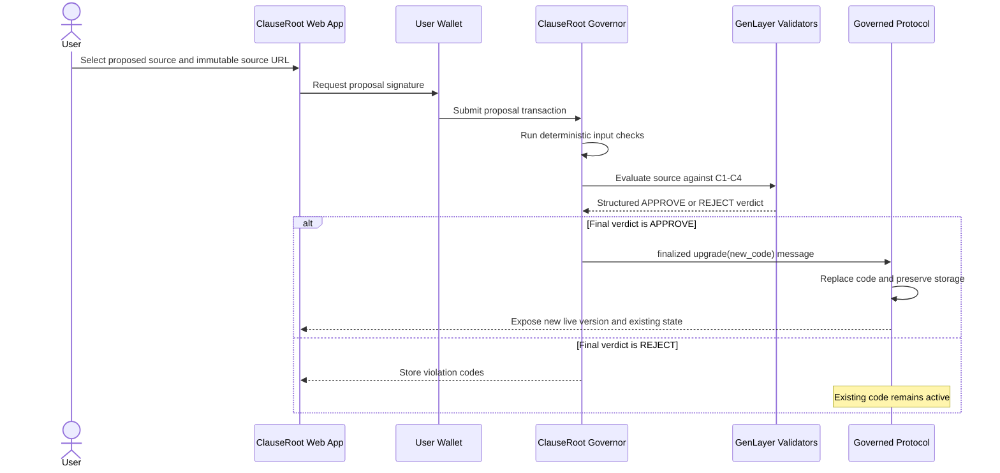
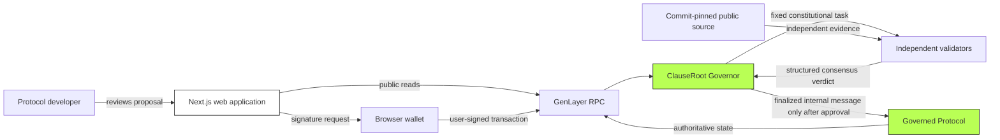

# ClauseRoot

ClauseRoot is constitutional upgrade control for autonomous protocols built on GenLayer.

It explores a simple idea: a protocol should be able to improve its code without giving one administrator, multisig, or governance group unrestricted power to rewrite its rules.

> ClauseRoot allows an upgrade only when the proposed code satisfies a small, fixed constitution and GenLayer validators reach consensus on that decision.

ClauseRoot is an experimental hackathon project. It is not a security audit, formal verification system, or guarantee that contract code is safe.

## Table of contents

1. [The problem](#the-problem)
2. [The solution](#the-solution)
3. [Who can use ClauseRoot](#who-can-use-clauseroot)
4. [How it works](#how-it-works)
5. [Constitution](#constitution)
6. [End-to-end flow](#end-to-end-flow)
7. [Architecture](#architecture)
8. [Repository structure](#repository-structure)
9. [Current implementation status](#current-implementation-status)
10. [Run locally](#run-locally)
11. [Run the tests](#run-the-tests)
12. [Using the web application](#using-the-web-application)
13. [Security and data policy](#security-and-data-policy)
14. [Technical decisions](#technical-decisions)
15. [Limitations and remaining work](#limitations-and-remaining-work)

## The problem

Protocols need to change over time. Bugs are discovered, features evolve, and operating conditions change.

Today, upgrade authority is commonly controlled by:

- one administrator key;
- a multisig;
- token voting;
- a security council; or
- another human-controlled process.

This creates a difficult choice:

- an immutable protocol cannot adapt; but
- an upgradeable protocol can be changed by whoever controls its upgrade authority.

Even when an administrator is trusted, users still depend on that administrator continuing to make good decisions.

## The solution

ClauseRoot places a Governor Intelligent Contract between upgrade proposers and the protocol being upgraded.

The Governor has a fixed, narrow constitution. When a developer proposes new source code, independent GenLayer validators evaluate one bounded question:

> Does this proposed target code violate any of the fixed constitutional clauses?

If the final consensus verdict is approval, the Governor sends a finalized internal upgrade message to the target contract. If the verdict is rejection, no upgrade message is sent and the existing target code remains active.

The browser application is only an interface. It displays live contract state and asks the user's wallet to sign transactions. It does not decide whether code is approved.

## Who can use ClauseRoot

The first intended users are small protocol teams that want controlled upgrades without leaving unrestricted upgrade power in a human administrator account.

Possible future use cases include:

- fee-controlled financial protocols;
- community treasuries with fixed custody guarantees;
- autonomous services that must preserve user withdrawal rights;
- protocols whose upgrade mechanism must never be bypassed; and
- experiments in machine-enforced governance constraints.

The current project deliberately uses a small demonstration protocol. It does not claim to support every production protocol or programming language.

## How it works

ClauseRoot uses two Intelligent Contracts:

### Governed Protocol

The target contract contains the protocol's persistent state and upgrade function. During initial setup, the deployer temporarily has bootstrap authority. That authority is transferred to the Governor and cannot be finalized a second time.

### ClauseRoot Governor

The Governor stores the governed target address and controls the upgrade path. The completed system will validate proposal metadata, run substantive constitutional review through GenLayer consensus, record the verdict, and emit an upgrade only after approval is finalized.

## Constitution

The MVP constitution is intentionally small so that every decision is understandable and testable.

| ID | Clause | Requirement |
| --- | --- | --- |
| C1 | Fee ceiling | The protocol fee must not exceed 2%. |
| C2 | User custody | An administrator must not be able to transfer user-owned funds arbitrarily. |
| C3 | Withdrawal right | Users must retain a direct way to withdraw their own balance. |
| C4 | Governor protection | The governed upgrade path must remain intact and cannot be replaced by an unrestricted upgrade route. |

The system stores stable violation codes instead of large AI-generated explanations. This keeps consensus output compact and makes the interface predictable.

## End-to-end flow



The target upgrade message uses finalization rather than early acceptance. A protocol upgrade is too important to execute before the appeal/finality process has completed.

## Architecture



### Authority boundaries

| Component | May do | Must not do |
| --- | --- | --- |
| Web app | Read public state and request wallet signatures | Decide constitutional outcomes or hold private keys |
| Wallet | Sign transactions approved by the user | Send the user's private key to the application |
| Governor | Evaluate fixed clauses, store verdicts, authorize approved upgrades | Accept caller-defined constitutions or silently approve failures |
| Validators | Independently evaluate the same source and clauses | Validate only JSON formatting |
| Target | Preserve protocol state and accept authorized upgrades | Restore bootstrap deployer authority |

No database is required for the MVP. Contract state is the authoritative source for deployment, proposal, decision, and execution data.

## Repository structure

```text
clauseroot/
├── app/                         Next.js App Router pages and UI
│   ├── activity/                On-chain proposal activity screen
│   ├── components/              Navigation, wallet, and shared UI
│   ├── proposal/                Proposal preparation screen
│   └── settings/                GenLayer Bradbury testnet information
├── contracts/
│   ├── governed_protocol_v1.py  Initial upgradeable target
│   ├── governed_protocol_v2.py  Compatible upgraded target
│   └── clause_root_governor_spike.py
│                                Minimal authority-path Governor
├── lib/genlayer.ts              GenLayerJS clients and live reads
├── tests/direct/                Fast contract behavior tests
├── tests/integration/           Real local simulator upgrade test
├── gltest.config.yaml           GenLayer test configuration
├── package.json                 Frontend dependencies and commands
└── requirements.txt             Python/GenLayer test dependencies
```

## Current implementation status

The repository currently proves the first critical technical path:

```text
Governor contract
-> finalized internal message
-> target upgrade(new_code)
-> target code changes from V1 to V2
-> existing target storage remains intact
```

Implemented and tested:

- a concrete pinned GenVM runner dependency;
- one-time transfer from bootstrap authority to the Governor;
- removal of the bootstrap upgrader during finalization;
- a Governor-to-target internal message using `on="finalized"`;
- native target code replacement;
- storage preservation across V1 to V2;
- direct contract tests;
- a local GenLayer simulator integration test;
- a multi-page Next.js interface;
- GenLayerJS public contract reads;
- browser-wallet connection through an EIP-1193 provider; and
- Bradbury Testnet network switching through GenLayerJS;
- deterministic validation of version, payload size, pinned runner and commit-pinned source URLs;
- a production Governor with independently repeated constitutional evaluation;
- normalized `APPROVE` or `REJECT` decisions and stable violation codes;
- one-shot scheduling of approved upgrades with no public direct-upgrade bypass;
- wallet-signed proposal submission and finalized execution-result checks; and
- live proposal history reads from Governor state.

The production Governor and UI path are implemented, while the repository's repeatable integration test still covers the lower-level finalized upgrade spike. A real-provider approved/rejected consensus run remains required before calling the complete golden path verified. See [Limitations and remaining work](#limitations-and-remaining-work).

## Run locally

### Requirements

- Node.js 20 or newer
- Python 3.12
- access to the public GenLayer Bradbury RPC at `https://rpc-bradbury.genlayer.com`
- an EIP-1193-compatible browser wallet for signed transactions

### Install frontend dependencies

```powershell
npm install
```

### Start the web application

```powershell
npm run dev
```

Open `http://localhost:3000`.

Available pages:

| Route | Purpose |
| --- | --- |
| `/` | Verify a live Governor/target pair and read target state |
| `/proposal` | Prepare and review proposed source |
| `/activity` | Display real on-chain proposal history when available |
| `/settings` | Inspect Bradbury Testnet and wallet configuration |

### Configure the wallet for Bradbury Testnet

| Setting | Value |
| --- | --- |
| RPC URL | `https://rpc-bradbury.genlayer.com` |
| Chain ID | `4221` |
| Explorer | `https://explorer-bradbury.genlayer.com/` |
| Currency symbol | `GEN` |

The Connect Wallet button asks the wallet for account access and requests a switch to GenLayer Bradbury Testnet. ClauseRoot never reads or stores the wallet's private key.

## Run the tests

PowerShell may block virtual-environment activation. Activation is optional; call the environment's Python executable directly.

### Create the environment

```powershell
py -3.12 -m venv .venv
.\.venv\Scripts\python.exe -m pip install -r requirements.txt
```

### Direct tests

```powershell
.\.venv\Scripts\python.exe -m pytest tests\direct -q
```

### Integration test

Start the GenLayer local simulator first, then run:

```powershell
.\.venv\Scripts\python.exe -m pytest tests\integration\test_upgrader_spike.py -q
```

### Frontend production build

```powershell
npm run build
```

The integration test deploys real local contracts, transfers upgrade authority, sends the finalized child upgrade transaction, rebuilds the contract interface against V2, and verifies that the original `persisted` value survived.

## Using the web application

1. Start the ClauseRoot web application and connect a wallet configured for Bradbury Testnet.
2. Deploy the target V1 contract.
3. Deploy the Governor with the target address.
4. Finalize target governance so the Governor becomes the authorized upgrader.
5. Open the Overview page.
6. Enter the real Governor and target addresses.
7. Select **Load live state**.
8. ClauseRoot reads the Governor's target address and rejects a mismatched pair.
9. If the pair matches, ClauseRoot reads target storage and governance state directly from Bradbury Testnet.
10. Connect a wallet when a signed transaction is required.

No addresses, transaction hashes, validator decisions, or proposal records are pre-populated. Every displayed chain record must come from the configured live network.

## Security and data policy

This repository intentionally contains no credentials.

- `.env` files are ignored.
- Python environments, dependency folders, build output, caches, and generated artifacts are ignored.
- Private keys are never accepted by the frontend.
- User transactions are signed by the browser wallet.
- The application uses only public RPC URLs and public contract addresses.
- No server signing key exists.
- No database contains shadow proposal state.
- No fallback converts a failed consensus process into approval.
- No fake transaction, validator, deployment, or activity data is rendered.

Before proposing an upgrade, use a public source URL pinned to a full commit SHA. Branch URLs such as `main` or `master` can change and must not be treated as immutable evidence.

## Technical decisions

### Why GenLayer?

The decision is semantic: validators need to inspect proposed source and determine whether it violates named rules. GenLayer provides an execution and consensus model for this bounded intelligent-contract decision.

### Why a fixed constitution?

Allowing each proposer to supply their own rules would let the proposal redefine the standard it must pass. The Governor owns the clause set.

### Why no backend database?

A separate database could disagree with the chain. The UI should reconstruct state from contracts and transaction lifecycle information.

### Why finalized messages?

An accepted result may still be challenged. Code replacement occurs only through a finalized internal message.

### Why separate read and wallet clients?

Public reads do not require wallet access. Signed writes use the provider supplied by the user's browser wallet. This limits wallet prompts and keeps private signing material outside ClauseRoot.

## Limitations and remaining work

The repository includes both a test-only authority spike and the production consensus Governor. The spike proves finalized cross-contract upgrading and storage preservation; the production Governor adds proposal guards, immutable-source matching, independent semantic evaluation, verdict storage, and approval-only execution.

Before ClauseRoot can be called complete, the following must be implemented and verified on a real GenLayer network:

- a real-provider integration test that proves a compliant V2 reaches consensus and upgrades;
- a real-provider integration test that proves the malicious V3 is rejected and creates no child upgrade;
- full semantic `genvm-lint check` completion in an environment where the pinned SDK runtime download succeeds;
- fee estimation/profile support for fee-charging hosted deployments;
- durable UI recovery from a saved transaction ID after refresh; and
- repeated browser-level tests of approved and rejected upgrades.

Until those items are complete, ClauseRoot should be described as an implemented constitutional-governor MVP whose real-provider consensus golden path is awaiting final integration verification, not a production security system.

## License

No license has been selected yet. All rights are reserved unless a license file is added.
